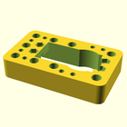
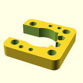
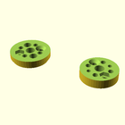

# OOBB Production File Summary for OOBB Holder For a Standard Servo (5x3)
OOBB Holder For a Standard Servo (5x3)
## files

* 3dpr_1.  Main - Main body piece  
* 3dpr_2.  Top - Top spacer piece  
* 3dpr_3.  Adapter - Adapter from OOBB to a servo horn  
* 3dpr_4.  Bearing - Holder for the 6705 bearing  
* 3dpr_all.  All - All pieces together  
